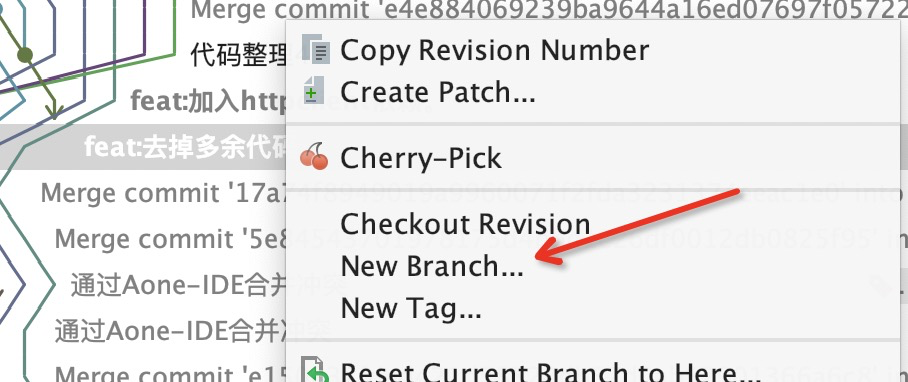
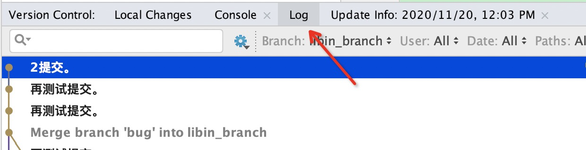
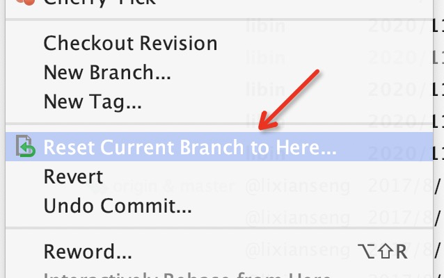

# [Idea里自己的分支合并了别人的分支并提交了，怎么回退](https://www.cnblogs.com/jiliunyongjin/p/14008567.html)

**最简单方法：**

在自己想要回退的地方，点New Branch，拉出一个新分支后在pull到远端。代码都是合并别人分支前的代码。

 

再来一种方法：

在Log选中你想要回退到到分支,右键选择 Reset Current Branch to Here.

 

 

 

 

git reset --mixed： 回退commit和add信息
git reset --soft：只回退了commit的信息。如果还要提交，直接commit即可

git reset --hard：彻底回退到某个版本，本地的源码也会变为上一个版本的内容，慎用！
