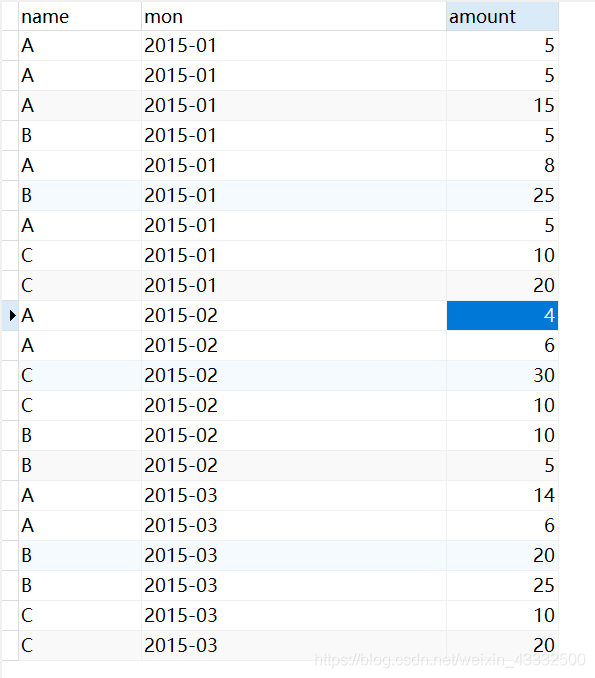
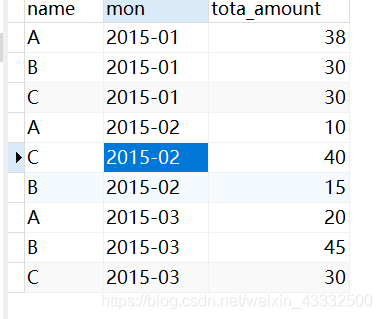

1、语法：
sum(字段1) over(partition by 字段2 order by 字段3 rows between unbounded preceding and current row) as 新字段名

2、功能：
实现组内累加

3、实例：
表sheet1，内容如下：



先对表中每人每月的收入求和：

```sql
select name,mon,sum(amount) as tota_amount
from sheet1 
group by name,mon
```


在此表基础上进行累计求和，即求每个人这几个月的工资累计求和

```SQL
select name,mon,tota_amount,
sum(tota_amount) over(partition by name order by mon rows between unbounded preceding and current row) as account
from 
(select name,mon,sum(amount) as tota_amount
from sheet1 
group by name,mon) as a
```


4、函数说明
sum(tota_amount)的求和是针对后面over()窗口的求和，
over中partition by name order by mon 针对name这一组按照月份排序，
rows between unbounded preceding and current row 限定了行是按照在当前行不限定的往前处理，通俗就是处理当前以及之前的所有行的sum，即3月时sum(amount)求的时1、2、3月的和，2月时sum(amount)求的是1、2月的和。unbounded意思无限的 preceding在之前的，current row当前行。

