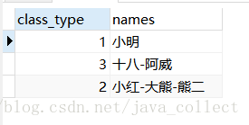
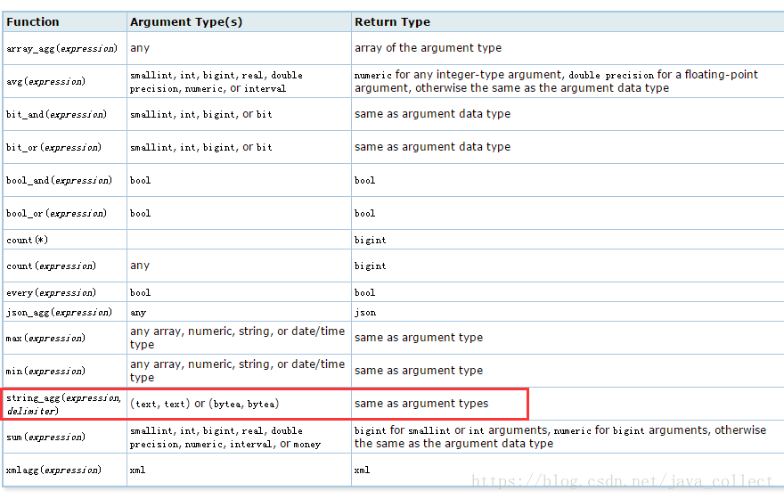

# Postgres中分组后拼接多行

现在有这样一个需求，表内容如：


，根据calss_type分组后，然后将name进行拼接返回，即：



mysql可以很方便的利用group_concat函数来实现，但是postgres9.0版本之前没有这样的函数，需要进行自定义函数，（参考博客）。
9.0版本后的postgres数据库，新增了许多函数：



我们可以用array_agg(),string_agg()等函数来实现。注意string_agg()方法参数都必须为字符串。

```SQL
select class_type,
string_agg(name,'-') as names
from user_account
group by class_type
#或者
select class_type,
array_to_string(array_agg(name),'-') as names
from user_account
group by class_type
```

